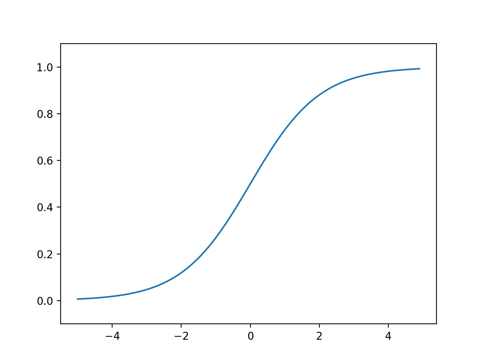
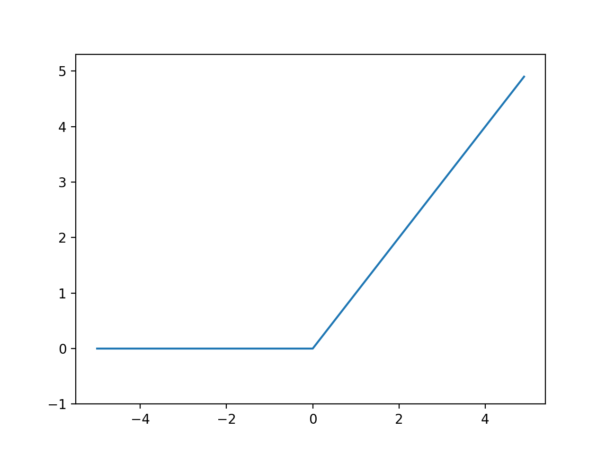
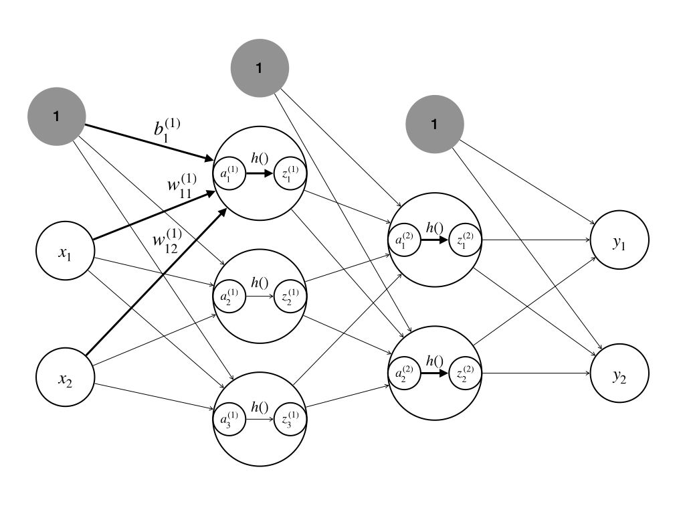
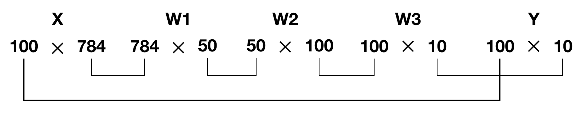

# 1-3 Neural Network
Perceptron에서 다음과 같이 h(x)로 표현하고, x가 0보다 크면 1을 출력, 작으면 0을 출력한다.

<center>


<!--
y=\begin{cases}
 0(w_{1}x_{1}+w_{2}x_{2}) \leq \theta   \\ 
 1(w_{1}x_{1}+w_{2}x_{2}) >  \theta   
\end{cases}
-->
</center>
<div style="text-align: right">
(1-3.1)
</div>

<center>


<!--
y=h(b+w_{1}x_{1}+w_{2}x_{2}) = h(x) = \begin{cases}
0 &  (x\leq 0) \\
1 & (x>0)
\end{cases}
-->
</center>
<div style="text-align: right">
(1-3.2)
</div>

---
### Activation Function
입력신호 종합을 출력 신호로 변환한다. (입력신호의 종합이 활성화를 일으키는지 정하는 역할)

다음과 같이 a를 이용해 표현한다.

<center>


<!--
x=b+w_{1}x_{1}+w_{2}x_{2} = a
-->
</center>
<div style="text-align: right">
(1-3.3)
</div>

<center>


<!--
y=h(a)
-->
</center>
<div style="text-align: right">
(1-3.4)
</div>
<br>

#### Sigmoid Function
Sigmoid는 'S자 모양'이라는 뜻이며, 0 ~ 1 실수 값을 출력한다. 계단 함수보다 다양한 출력 값 존재하고, 비선형 함수이다.

<center>


<!--
h(x)=\frac{1}{1+e^{-x}}
-->
</center>
<div style="text-align: right">
(1-3.5)
</div>
<br>

```python
# The sigmoid function
def sigmoid(x):
    return 1 / (1 + np.exp(-x))

x = np.array([-1.0, 1.0, 2.0])
print("sigmoid = ", sigmoid(x))


x = np.arange(-5.0, 5.0, 0.1)
y = sigmoid(x)

plt.plot(x, y)
plt.ylim(-0.1, 1.1)
plt.show()
```
##### Output
> sigmoid =  [0.26894142 0.73105858 0.88079708]

<center>



Fig. 1-3.1 Sigmoid
</center>
<br>


##### 여기서 잠깐!
선형 함수는 Output이 Input의 상수 배 만큼 변하게 한다. 비선형 함수는 직선 1개로 못 그린다.

신경망에서는 비선형 함수를 이용한다.

Why? 선형함수를 이용하면 은닉층을 깊게 하더라도 단층이랑 같아지기 때문이다.

(ex, y = h(h(h(h(x))))) = c * c * c * c * x, 이말은 a = c^4 으로 끝나버리기 때문이다!)

<br>


#### ReLU
Rectified Linear Unit, 렐루

Input이 0을 넘으면 그대로 출력, 아니면 0을 출력한다.

<center>


<!--
h(x)=\begin{cases}
x & (x > 0) \\ 
0 & (x \leqslant 0) 
\end{cases}
-->
</center>
<div style="text-align: right">
(1-3.6)
</div>
<br>

```python
def relu(x):
    return np.maximum(0, x)

x = np.arange(-5.0, 5.0, 0.1)
y = relu(x)

plt.plot(x, y)
plt.ylim(-1.0, 5.3)
plt.show()
```
<center>



Fig. 1-3.2 ReLU
</center>
---

### Matrix Multiplication on Neural Network
행렬곱에서 대응하는 차원의 원소 수를 일치 시키듯이 신경망에서도 각 층의 뉴런과 가중치의 차원의 원소 수를 일치 시켜야 한다.

(shape 일치)

다음 그림의 첫 번째 은닉층의 activation function을 계산할 때 input X, weight W는 행렬로 표현되어 계산된다.

(행렬곱은 하드웨어적으로 매니코어, 소프트웨어적으로 멀티스레드에서 동시에 실행가능하므로 특히 GPU가 연산하기 적합하다.)

입력의 Shape는 (다음 층의 뉴런 수,)

가중치의 Shape는 (이전 층의 뉴런 수, 다음 층의 뉴런 수)

Bias의 Shape는 (다음 층의 뉴런 수,)

<center>



Fig. 1-3.3 input to first layer
</center>

a11을 계산하기 위해서 다음과 같이 계산 되는데,

<center>


<!--
a_{1}^{(1)} = b_{1}^{(1)}+w_{11}^{(1)}x_{1}+w_{12}^{(1)}x_{2}
-->
</center>
<div style="text-align: right">
(1-3.7)
</div>


첫 번째 은닉층의 activation function 결과는 행렬 A로 계산되고, 다음과 같이 행렬로 표현된다.

<center>


<!--
A^{(1)}=B^{(1)}+XW^{(1)}
-->
</center>
<div style="text-align: right">
(1-3.8)
</div>


<center>


<!--
A^{(1)}=\begin{bmatrix}
a_{1}^{(1)} & a_{2}^{(1)} & a_{3}^{(1)}
\end{bmatrix}
\\
\\
B^{(1)}=\begin{bmatrix}
b_{1}^{(1)} & b_{2}^{(1)} & b_{3}^{(1)}
\end{bmatrix}
,
X=\begin{bmatrix}
x_{1} & x_{1}
\end{bmatrix}
\\
\\
W^{(1)}=\begin{bmatrix}
w_{11}^{(1)} & w_{21}^{(1)} & w_{31}^{(1)}\\
w_{12}^{(1)} & w_{22}^{(1)} & w_{32}^{(1)}
\end{bmatrix}
-->
</center>
<div style="text-align: right">
(1-3.9)
</div>


```python
import numpy as np
import activation_function_on_NN as af_lib


def identity_function(u):
    return u


def init_network():
    network = {}
    network['B1'] = np.array([0.1, 0.2, 0.3])
    network['W1'] = np.array([[0.1, 0.3, 0.5], [0.2, 0.4, 0.6]])
    network['B2'] = np.array([0.1, 0.2])
    network['W2'] = np.array([[0.1, 0.4], [0.2, 0.5], [0.3, 0.6]])
    network['B3'] = np.array([0.1, 0.2])
    network['W3'] = np.array([[0.1, 0.3], [0.2, 0.4]])

    return network


def forward(network, x):
    B1, B2, B3 = network['B1'], network['B2'], network['B3']
    W1, W2, W3 = network['W1'], network['W2'], network['W3']

    a1 = np.dot(x, W1) + B1
    z1 = af_lib.sigmoid(a1)
    a2 = np.dot(z1, W2) + B2
    z2 = af_lib.sigmoid(a2)
    a3 = np.dot(z2, W3) + B3

    y = identity_function(a3)

    return y


network = init_network()

x = np.array([1.0, 0.5])
y = forward(network, x)
print(y)
```

#####  Output
>[0.31682708 0.69627909]

<br>

---

### Output layer

신경망은 출력층에 따라 분류, 회기 어디에 이용될 지 다르다.

(분류는 Softmax, 회기는 항등함수(Identity function)을 많이 사용한다.)

출력층의 각 뉴런이 모든 입력 신호에서 영향을 받는다. (FC Layer 처럼 됨)

<br>

#### Softmax

0 ~ 1 값을 출력한다. 오버플로우 때문에 수정된 식을 사용한다. (지수가 너무 커져서 64bit도 표현하기 힘듬)

출력의 총합이 1이 되기 때무에, 각 출력은 확률로 볼 수 있다.

C는 보통 입력 중에 제일 큰 값을 해주고, a-c 이렇게 넣어주면 오버플로우 방지가 가능하다.

<center>


<!--
\begin{align*}
y_{k} = \frac{e^{a_{k}}}{\sum_{i=1}^{n}e^{a_{i}}} &= \frac{Ce^{a_{k}}}{C\sum_{i=1}^{n}e^{a_{i}}}\\ 
 &= \frac{e^{(a_{k}+logC)}}{\sum_{i=1}^{n}(e^{a_{i}}+logC)}\\ 
 &= \frac{e^{(a_{k}+{C}')}}{\sum_{i=1}^{n}(e^{a_{i}}+{C}')}
\end{align*}
-->
</center>
<div style="text-align: right">
(1-3.10)
</div>

```python
def softmax(a):
    c = np.max(a)
    exp_a = np.exp(a - c)   # for overflow
    sum_exp_a = np.sum(exp_a)

    y = exp_a / sum_exp_a

    return y
```

<br>

그리고 출력층의 뉴런 수는 해결하려는 문제에 맞게 적절히 정해야 한다.

(분류하고 싶은 클래스 수로 설정하는 것이 일반적이다.)

<br>

---

### Exercise: Recognize the handwriting using MNIST

입력층은 이미지의 픽셀 수 만큼 뉴런 수 지정,

첫 번째 은닉층은 50개 뉴런, 두 번째 은닉층은 100개 뉴런 (임의로 지정)

출력층은 클래스구분 개수에 따라 10개의 뉴런을 할당하였다.

<br>

아래 코드는 sigmoid에서 Overflow가 발생한다.

Why? 지수승으로 처리하다 보니 발생한 것으로 보이며, Softmax와 같이 상수로 처리하는 방법을 알아보자.

<br>

```python
import sys, os
sys.path.append("/Users/dayday/MyGithub/Deep-Learning-from-Scratch")      # 부모 디렉터리의 파일을 가져울 수 있도록 설정
import numpy as np
import pickle
from dataset.mnist import load_mnist
from common.functions import sigmoid, softmax
from PIL import Image


def img_show(img):
    pil_img = Image.fromarray(np.uint8(img))
    pil_img.show()

# 처음 한 번은 몇 분 정도 걸린다.
# 데이터 가져오기
def get_data():
    (x_train, t_train), (x_test, t_test) = load_mnist(flatten=True, normalize=False)
    return x_test, t_test


def init_network():
    with open("./1-3_Neural_Network/src/sample_weight.pkl", "rb") as f:
        network = pickle.load(f)
    return network


def predict(network, x):
    B1, B2, B3 = network['b1'], network['b2'], network['b3']
    W1, W2, W3 = network['W1'], network['W2'], network['W3']

    a1 = np.dot(x, W1) + B1
    z1 = sigmoid(a1)
    
    a2 = np.dot(z1, W2) + B2
    z2 = sigmoid(a2)

    a3 = np.dot(z2, W3) + B3
 
    y = softmax(a3)

    return y

x, t = get_data()
network = init_network()
accuracy_cnt = 0
for i in range(len(x)):
    y = predict(network, x[i])
    p = np.argmax(y)            # 확률이 가장 높은 원소의 인덱스 얻음
    if p == t[i]:
        accuracy_cnt += 1

print("Accuracy: " + str(float(accuracy_cnt) / len(x)))

sys.path.remove("/Users/dayday/MyGithub/Deep-Learning-from-Scratch")
```
<br>

##### Output

> /Users/dayday/MyGithub/Deep-Learning-from-Scratch/common/functions.py:14: RuntimeWarning: overflow encountered in exp

> return 1 / (1 + np.exp(-x))

> Accuracy: 0.9207

<br>

#### Batch

Batch는 여러 개를 묶어서 한 번에 실행 가능하게 해준다.

Input의 첫 번째 shape와 Output의 첫 번째 shape가 같다는 것에 명심하자. 

(당연하게도, 한 번에 여러 이미지를 처리하니 출력이 이미지 개수 만큼 나오는 것이 맞다.)

<center>



Fig. 1-3.4 Batch
</center>
<br>

```python
import sys, os
sys.path.append("/Users/dayday/MyGithub/Deep-Learning-from-Scratch")      # 부모 디렉터리의 파일을 가져울 수 있도록 설정
import numpy as np
import pickle
from dataset.mnist import load_mnist
from common.functions import sigmoid, softmax
from PIL import Image


def img_show(img):
    pil_img = Image.fromarray(np.uint8(img))
    pil_img.show()

# 처음 한 번은 몇 분 정도 걸린다.
# 데이터 가져오기
def get_data():
    (x_train, t_train), (x_test, t_test) = load_mnist(flatten=True, normalize=False)
    return x_test, t_test


def init_network():
    with open("./1-3_Neural_Network/src/sample_weight.pkl", "rb") as f:
        network = pickle.load(f)
    return network


def predict(network, x):
    B1, B2, B3 = network['b1'], network['b2'], network['b3']
    W1, W2, W3 = network['W1'], network['W2'], network['W3']

    a1 = np.dot(x, W1) + B1
    z1 = sigmoid(a1)
    
    a2 = np.dot(z1, W2) + B2
    z2 = sigmoid(a2)

    a3 = np.dot(z2, W3) + B3
 
    y = softmax(a3)

    return y

x, t = get_data()
network = init_network()

batch_size = 100                # for batch
accuracy_cnt = 0


for i in range(len(x)):
    x_batch = x[i:i+batch_size]         # for batch
    y_batch = predict(network, x_batch) # for batch

	p = np.argmax(y_batch, axis=1)
    accuracy_cnt += np.sum(p == t[i:i+batch_size])


print("Accuracy: " + str(float(accuracy_cnt) / len(x)))

sys.path.remove("/Users/dayday/MyGithub/Deep-Learning-from-Scratch")
```
<br>

##### Output

> /Users/dayday/MyGithub/Deep-Learning-from-Scratch/common/functions.py:14: RuntimeWarning: overflow encountered in exp

> return 1 / (1 + np.exp(-x))

> Accuracy: 91.5954


